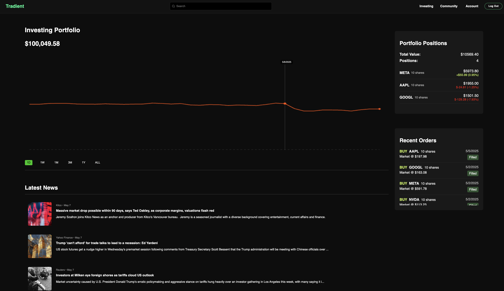
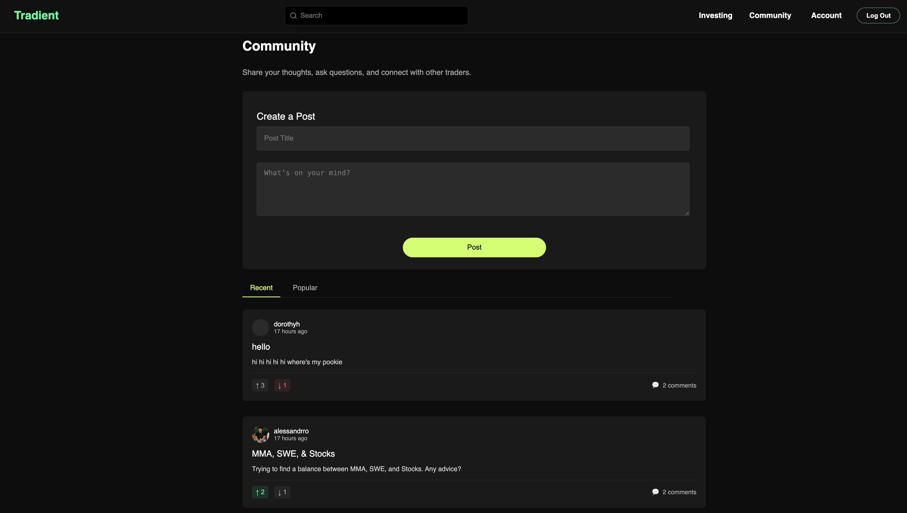
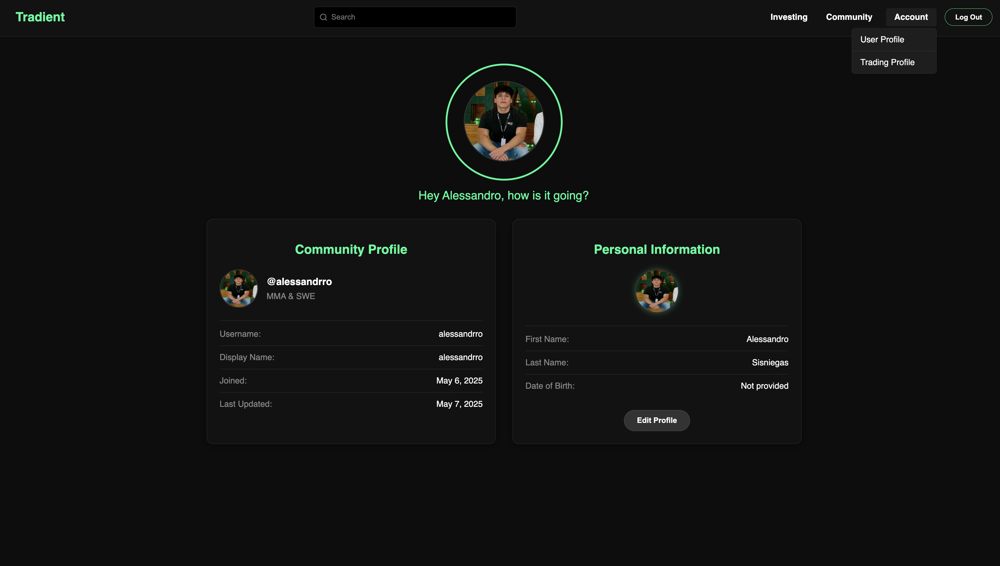
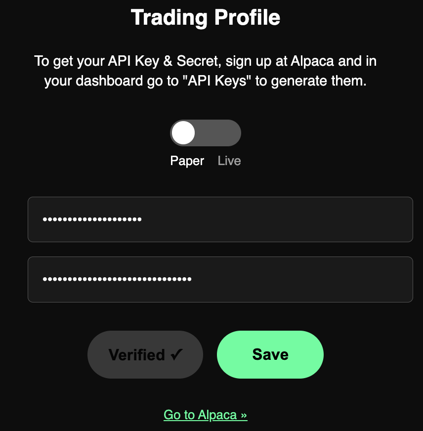

# 📈 Tradient - Simulated Stock Trading Platform

**Tradient** is a full-stack, stock trading simulator that lets users trade with real-time prices, analyze portfolio performance, view financial news with sentiment scoring, and engage in a trading-focused community — all powered by modern frontend/backend tooling and ML-driven insights.

🌐 **Live**: [https://tradientv2.vercel.app](https://tradientv2.vercel.app)

---

## 🚀 Features

### 🧑‍💼 Core User Features
- 📊 **Live Stock Tracking** – View real-time prices, company info, and historical trends
- 🛒 **Paper Trading via Alpaca** – Buy/sell stocks with order history and profit/loss tracking
- 🗂 **Portfolio Overview** – Visual breakdown of stock positions and performance
- 📰 **News Sentiment Analysis** – ML models detect sentiment from financial headlines
- 💬 **Community Forum** – Create posts, comment, and react to market discussions

### 🧑‍🔧 Admin/Infra Features
- 🔐 Rust-based proxy server to secure internal API endpoints
- 🧠 ML microservices for sentiment analysis and market behavior prediction
- 📈 Admin metrics dashboard powered by Grafana + Firestore logging
- ⚙️ Modular architecture with Docker, GCP VMs, and Cloud Run services

---

## 🖼️ System Architecture

[High Level Design Doc - Excalidraw 🔗](https://excalidraw.com/#json=h1u4n5PznFNfu2EGknhMj,XOcVNeLJB42OPWeUjDLZRA)

This diagram shows:
- React frontend deployed on Netlify
- A Rust proxy server on Cloud Run for API abstraction and security
- Python Flask-based microservices (on Dockerized GCP VMs) for:
  - Real-time pricing
  - Order handling
  - Sentiment analysis
  - Transaction history
- ML Worker node (TensorFlow, PyTorch) for inference tasks
- Firebase (Auth + Firestore) for logging and account storage
- Admin Dashboard for system monitoring (Grafana + Node/TS)

---

## 🖥️ Preview

### 📊 Portfolio Dashboard + News Feed

  

  

### 💬 Community Forum

  

  

### 👤 Profile Page

  

  

### 🦙 Trading Profile

  

---

## Tech Stack

| Layer             | Technologies Used                                                                 |
|-------------------|-----------------------------------------------------------------------------------|
| Frontend          | React, TypeScript, Tailwind CSS, Vite, Firebase Auth                              |
| Proxy Server      | Rust (Axum), Docker, Google Cloud Run                                             |
| Backend Services  | Rust (Axum), Python (Flask), Docker, GCP Virtual Machines (Debian/Intel)          |
| ML Inference Node | Python, TensorFlow, PyTorch (macOS-based worker)                                  |
| Data APIs         | Alpaca API (trading), FinMod API (market/news data)                               |
| Admin Dashboard   | Node.js, TypeScript, Grafana                                                      |
| Storage & Auth    | Firebase Firestore (metrics, auth)                                                |
